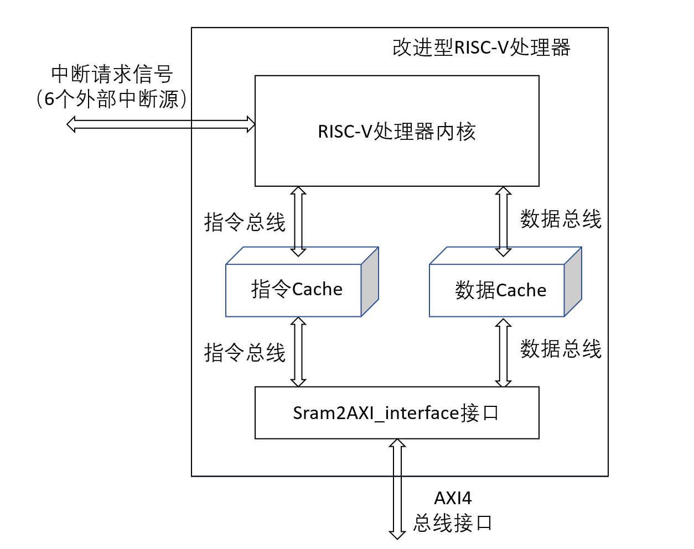
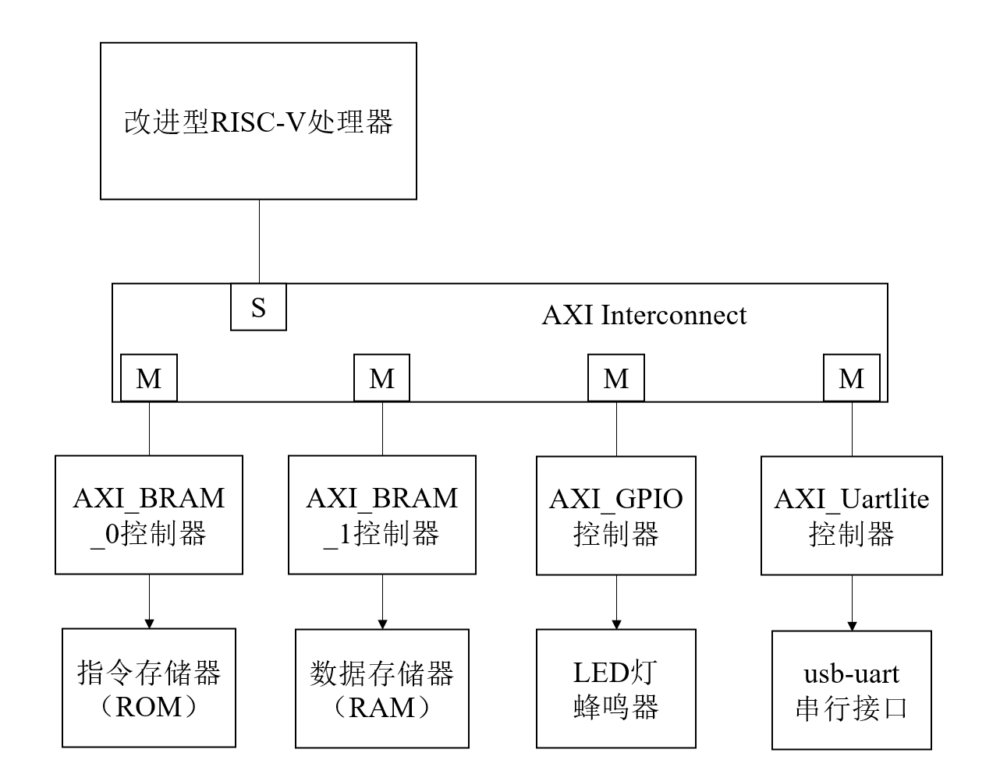
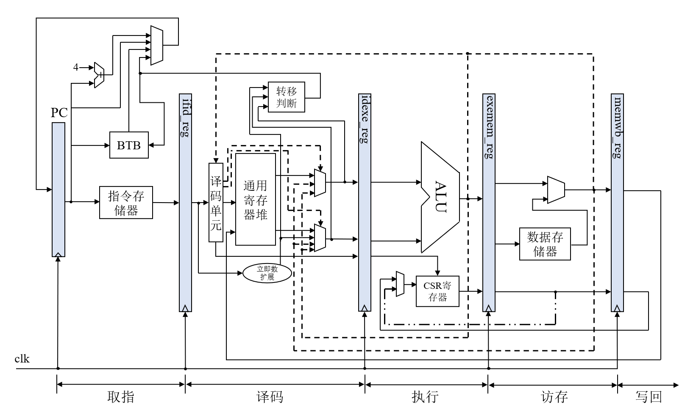
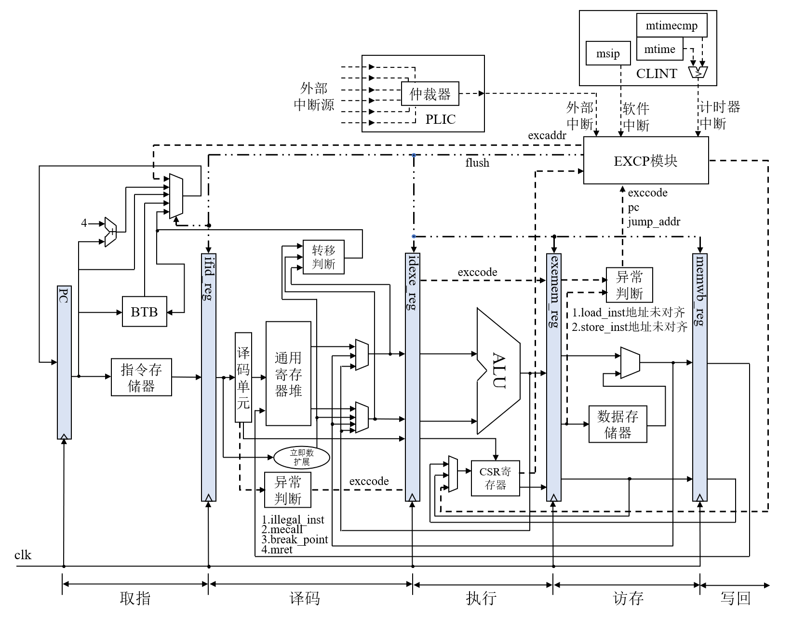
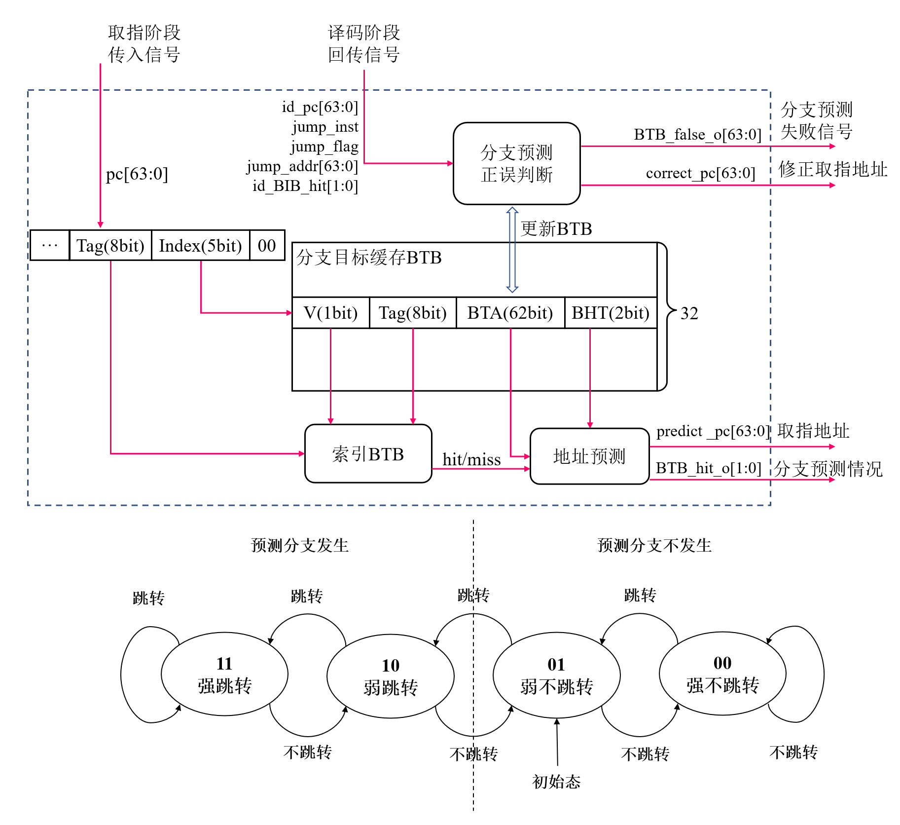
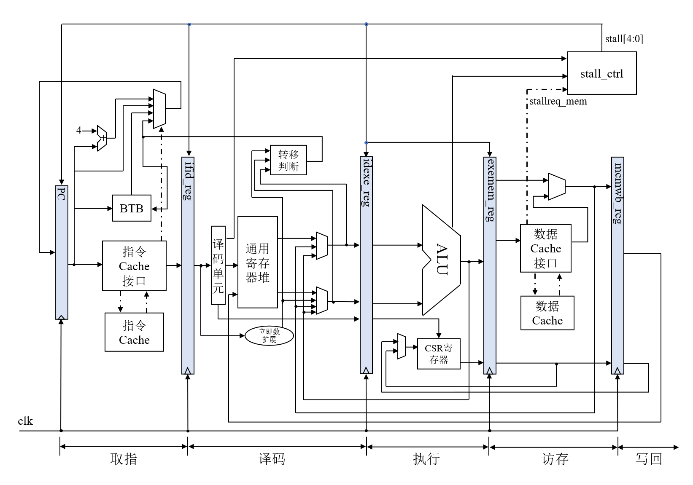

# A Chisel-based RISC-V Processor myc01
This is a Chisel-based RV64IM processor containing a 
five-stage pipeline. The processor supports dynamic 
branch prediction and exception/interrupt handling. 
Additionally, it includes an instruction cache and a data cache, both of which are direct-mapped and write-through.
The processor is equipped with an AXI4 bus interface that allows for memory and external device access (e.g. GPIO, UART). It is capable of operating at 50MHz on the ZYNQ7020.

## _Description of Document_
- The hardware design files are located at
```
/src/main/scala
```

- The Chisel test code for the different kinds of instructions is located at
```
/testcode
```

- The Verilog generated by Chisel is in
```
/generated/myc01_wrapper.v
```

- If you want to modify or regenerate this design, please rebuild this project in a Chisel project way.

- Tests for the processor with caches can be performed in Vivado by creating BRAMs IP with AXI4 ports.

## _Design Details_
- Overall Structure
  
  
- Five-stage Pipeline Structure
  
- Interrupt/Exception Handling
  
- Dynamic Branch Prediction
  
- Adding Cache
  

